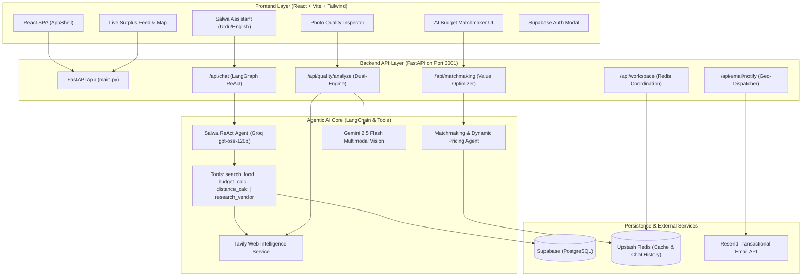

# ManOSalwaKnot — Comprehensive Project Documentation & Technical Architecture

> **Next-Generation Autonomous AI Food Rescue Marketplace & Zero-Waste Logistics Platform**  
> Built for Hackathon MVP | Production-Ready Architecture

---

## 1. Executive Summary

### 1.1 The Problem
Every year, over 36 million tonnes of food are wasted in Pakistan and South Asia, while millions of families face food insecurity. Commercial kitchens, restaurants, wedding halls, and bakeries discard surplus edible food at the end of shifts because:
1. **Lack of Fast Liquidation**: No real-time channel exists to connect kitchens with nearby individuals or NGOs before food spoils.
2. **Deceptive Media & Trust Deficit**: Consumers distrust food photos on marketplaces due to spoilage risks and packaging hygiene fears.
3. **Friction in Coordination**: Traditional e-commerce checkout and online payment gateways create friction when dealing with time-sensitive surplus food.

### 1.2 The Solution: ManOSalwaKnot
ManOSalwaKnot is a real-time, hyperlocal food rescue network powered by **Agentic AI**:
* **Salwa ReAct Autonomous Concierge**: A bilingual (English & Roman Urdu) multi-tool AI assistant that searches real database listings and evaluates budgets.
* **Dual-Verification Quality AI**: Combines Google Gemini 2.5 Flash Vision (image spoilage inspection) with Tavily AI Search (real-world kitchen hygiene verification).
* **AI Budget & Nutrition Matchmaker**: Optimizes calorie and party-size economy for families, and provides dynamic pricing curves for kitchens to ensure zero food waste.
* **Zero-Friction 1-Click Pickups**: Generates instant pickup voucher codes (`#RSV-XXXX`) for cash-on-pickup reservations.
* **Automated Geospatial Alert Engine**: Dispatches branded email alerts via Resend to nearby community subscribers.

---

## 2. Complete Technology Stack

| Layer | Technology | Version | Purpose in Application |
| :--- | :--- | :--- | :--- |
| **Frontend Framework** | **React** | `18.3.1` | Reactive component hierarchy, state management, SPA routing |
| **Language (Frontend)** | **TypeScript** | `5.5.3` | Type safety across profiles, transactions, and AI payloads |
| **Styling & Design** | **Tailwind CSS** | `3.4.1` | Custom theme with navy (`#001F3F`) and brand green (`#4CAF50`) |
| **Iconography** | **Lucide React** | `^0.344.0` | Accessible modern iconography across UI views |
| **Build Tool** | **Vite** | `5.4.8` | Ultra-fast HMR and optimized production bundling |
| **Backend Framework** | **FastAPI** | `0.115.0` | High-performance Python async REST API |
| **Server Engine** | **Uvicorn** | `0.30.0` | ASGI web server running with auto-reload |
| **Agentic AI Engine** | **LangChain & LangGraph** | `0.3.3` | Autonomous ReAct agent orchestration and tool execution |
| **Inference LLM** | **Groq (`openai/gpt-oss-120b`)**| Latest | Ultra-low latency bilingual LLM for chat & matchmaking |
| **Computer Vision AI** | **Google Gemini 2.5 Flash** | `v1beta` | Multimodal visual spoilage, packaging, and freshness inspection |
| **Web Research AI** | **Tavily AI Search API** | REST | Real-time web agent for vendor reviews & NGO credibility |
| **Database & Auth** | **Supabase** | `2.9.1` | Hosted PostgreSQL database, Row Level Security, Auth sessions |
| **In-Memory Cache** | **Upstash Redis** | `1.1.0` | Distributed caching for AI queries, chat history, drop coordination |
| **Email Dispatch** | **Resend API** | `2.0.0` | Transactional branded HTML alert dispatch to community members |
| **Deployment Targets** | **Vercel** + **Render** | Cloud | Frontend hosted on Vercel; Backend running on Render Python container |

---

## 3. System Architecture Diagram



---

## 4. Deep-Dive: The 4 Agentic AI Systems

### 4.1 Agent 1: Salwa Autonomous ReAct Concierge
* **Model:** Groq `openai/gpt-oss-120b` running via LangGraph `create_react_agent`.
* **Autonomous Behavior:** When a user asks a question, Salwa does not guess or generate hallucinated food. Instead, it enters a **Thought $\rightarrow$ Action $\rightarrow$ Observation** cycle:
  1. `search_food_tool`: Interrogates live food posts matching the query or budget.
  2. `budget_calculator_tool`: Autonomously computes per-person pricing, party size feasibility, and savings.
  3. `distance_calculator_tool`: Computes geospatial Haversine distance in real time.
  4. `research_food_business_tool`: Queries Tavily AI to check vendor cleanliness track record.
* **Bilingual Intelligence:** Fluent in English, Urdu, and Roman Urdu (e.g. *"kia koi post ha available mjy 200pkr ma chiyan"* $\rightarrow$ responds in Roman Urdu listing Daal Chawal for Rs 180 and Paneer Wraps for Rs 120).

### 4.2 Agent 2: Dual-Verification Food Quality & Authenticity Inspector
* **Engine:** Google Gemini 2.5 Flash Vision + Tavily AI Web Agent.
* **Autonomous Behavior:**
  1. **Visual Spoilage Scan**: Evaluates food photo pixels for discoloration, packaging seal condition, and temperature risks; generates an integer score (0–100) and Trust Badge (`verified`, `good`, `caution`, `warning`).
  2. **Web Reputation Verification**: Cross-references the vendor name with live web reviews, health department ratings, and NGO certifications via Tavily AI.
  3. **Autonomous Synthesis**: Combines visual data with vendor authenticity to protect buyers from deceptive photos.

### 4.3 Agent 3: AI Budget Matchmaker & Dynamic Markdown Engine
* **Engine:** LangChain + Groq LLM + Heuristic Value Scorer.
* **Autonomous Behavior:**
  * **For Consumers**: Evaluates available listings against user budget (PKR), party size, and distance. Automatically prioritizes newly posted community drops and provides nutritional economic insights.
  * **For Kitchens**: Dynamically calculates optimal markdown curves based on time remaining until expiry:
    * `6+ hours`: 20–30% discount
    * `3–5 hours`: 40–50% discount (peak liquidation volume)
    * `<2 hours`: 70–80% clearance or automated donation routing to shelter NGOs.

### 4.4 Agent 4: Autonomous Geospatial Alert & Dispatch Agent
* **Engine:** Event-driven trigger + Haversine Radius Math + Resend API.
* **Autonomous Behavior:**
  * When a restaurant publishes a surplus drop, the agent:
    1. Queries registered subscribers from `food_subscriptions`.
    2. Calculates distance to each subscriber.
    3. Renders a mobile-responsive, branded HTML card with food details, expiry countdown, and pickup button.
    4. Automatically dispatches the email via Resend sandbox gateway.

---

## 5. Database Schema & Data Models

### 5.1 `profiles` Table
```sql
CREATE TABLE profiles (
    id UUID PRIMARY KEY REFERENCES auth.users(id),
    email TEXT NOT NULL,
    name TEXT NOT NULL,
    role TEXT CHECK (role IN ('restaurant', 'hostel', 'individual')) DEFAULT 'individual',
    phone TEXT,
    location_text TEXT,
    lat FLOAT,
    lng FLOAT,
    tier TEXT CHECK (tier IN ('free', 'prime', 'ngo')) DEFAULT 'free',
    avatar_url TEXT,
    rating FLOAT DEFAULT 5.0,
    rating_count INT DEFAULT 1,
    created_at TIMESTAMP WITH TIME ZONE DEFAULT NOW()
);
```

### 5.2 `food_posts` Table
```sql
CREATE TABLE food_posts (
    id UUID PRIMARY KEY DEFAULT gen_random_uuid(),
    user_id UUID REFERENCES profiles(id),
    food_name TEXT NOT NULL,
    quantity NUMERIC NOT NULL,
    unit TEXT DEFAULT 'portions',
    price NUMERIC NOT NULL,
    original_price NUMERIC,
    expiry_time TIMESTAMP WITH TIME ZONE NOT NULL,
    location_text TEXT NOT NULL,
    lat FLOAT,
    lng FLOAT,
    photo_url TEXT,
    description TEXT,
    status TEXT CHECK (status IN ('available', 'reserved', 'sold', 'expired')) DEFAULT 'available',
    created_at TIMESTAMP WITH TIME ZONE DEFAULT NOW(),
    updated_at TIMESTAMP WITH TIME ZONE DEFAULT NOW()
);
```

### 5.3 `transactions` Table
```sql
CREATE TABLE transactions (
    id TEXT PRIMARY KEY,
    buyer_id UUID REFERENCES profiles(id),
    seller_id UUID REFERENCES profiles(id),
    food_id UUID REFERENCES food_posts(id),
    food_name TEXT NOT NULL,
    amount NUMERIC NOT NULL,
    commission NUMERIC DEFAULT 0,
    payment_method TEXT DEFAULT 'cash',
    status TEXT CHECK (status IN ('pending', 'completed', 'cancelled')) DEFAULT 'pending',
    delivered_at TIMESTAMP WITH TIME ZONE,
    created_at TIMESTAMP WITH TIME ZONE DEFAULT NOW()
);
```

---

## 6. Complete API Reference

### 6.1 `POST /api/chat`
* **Purpose:** Multi-turn ReAct Salwa Chatbot with live database grounding.
* **Request:**
  ```json
  {
    "message": "kia koi post ha available mjy 200pkr ma chiyan",
    "userId": "user-uuid",
    "language": "ur"
  }
  ```
* **Response:**
  ```json
  {
    "reply": "Ji! Aapke budget (Rs 200) mein Daal Chawal Meals (Rs 180) aur Paneer Wraps (Rs 120) available hain! Discover tab se reserve karein.",
    "language": "ur",
    "postsFound": 2
  }
  ```

### 6.2 `POST /api/matchmaking`
* **Purpose:** Evaluates budget, party size, and coordinates to rank best food drops.
* **Request:**
  ```json
  {
    "userId": "user-uuid",
    "budget": 500,
    "people": 4,
    "lat": 24.8607,
    "lng": 67.0011
  }
  ```
* **Response:**
  ```json
  {
    "recommendations": [
      {
        "foodId": "mock-1",
        "foodName": "Chicken Biryani",
        "score": 96,
        "reason": "Costs Rs 87/person with 50% discount. 2.3 km away.",
        "price": 350,
        "sellerName": "Nawab Kitchen",
        "distance": 2.3
      }
    ],
    "aiInsights": "Chicken Biryani fits perfectly—at just Rs 87 per head it feeds all 4 guests comfortably!",
    "pricingGuide": {
      "tier1": "8+ hrs to expiry: 20-30% discount",
      "tier2": "4-6 hrs to expiry: 40-50% discount",
      "tier3": "<2 hrs to expiry: 70-80% clearance discount"
    }
  }
  ```

### 6.3 `POST /api/quality/analyze`
* **Purpose:** Dual-Verification Food Spoilage & Vendor Web Authenticity Scan.
* **Request:**
  ```json
  {
    "imageUrl": "https://images.pexels.com/.../biryani.jpg",
    "vendorName": "Al-Madina Kitchen",
    "location": "Karachi"
  }
  ```
* **Response:**
  ```json
  {
    "qualityScore": 92,
    "freshness": "Freshly prepared portion, vibrant color texture",
    "hygiene": "Clean commercial packaging, sealed properly",
    "presentation": "Authentic presentation matching portion standards",
    "concerns": ["Consume within 4 hours of collection"],
    "recommendation": "Safe for surplus rescue. Meets food safety criteria.",
    "trustBadge": "verified",
    "verifiedVendor": true,
    "trustSummary": "Dual Verification: Visual condition is fresh and kitchen hygiene record confirmed."
  }
  ```

### 6.4 `POST /api/email/notify`
* **Purpose:** Dispatches branded food alert email to registered subscribers within radius.
* **Request:** `{"foodPostId": "mock-1"}`
* **Response:** `{"notified": 1}`

---

## 7. How to Test & Demo Across User Roles

| Role | Test Step | What Happens |
| :--- | :--- | :--- |
| **Restaurant** | 1. Go to **"Post surplus"**<br>2. Upload food photo or choose preset<br>3. Click **"Inspect Photo AI"**<br>4. Click **"Publish Rescue Drop"** | * Gemini Vision analyzes photo freshness (0–100 score + badge).<br>* Drop appears live on feed and syncs to Redis.<br>* Email alert dispatched to subscribers. |
| **Individual** | 1. Open **"Discover food"** or **"Overview"**<br>2. Click **"View details"** on any card<br>3. Click **"Reserve for Pickup"**<br>4. Open **"AI Matchmaker"** (Budget: 100, People: 1)<br>5. Open **"Ask Salwa"** (Ask in Roman Urdu) | * Instant pickup voucher code generated (`#RSV-XXXX`).<br>* Logged into **"My activity"** ledger dynamically.<br>* Matchmaker ranks budget options.<br>* Salwa answers in natural Roman Urdu. |
| **NGO / Hostel**| 1. Open **"Food quality AI"**<br>2. Type vendor name<br>3. Check **"Profile"** notification radius | * Tavily AI validates kitchen hygiene & community track record.<br>* Proactive email alerts delivered directly to inbox. |

---

## 8. Deployment Quick Reference

### Frontend on Vercel
* **Repository:** Your personal GitHub repo
* **Root Directory:** `project`
* **Framework:** `Vite`
* **Environment Variables:**
  * `VITE_SUPABASE_URL`: `https://dekhpodsixpfonoqwkwx.supabase.co`
  * `VITE_SUPABASE_ANON_KEY`: `eyJhbGciOiJIUzI1NiIsInR5cCI6IkpXVCJ9...`
  * `VITE_API_URL`: `<YOUR_RENDER_BACKEND_URL>`

### Backend on Render
* **Repository:** Your personal GitHub repo
* **Root Directory:** `project/backend`
* **Environment:** `Python 3`
* **Build Command:** `pip install -r requirements.txt`
* **Start Command:** `uvicorn main:app --host 0.0.0.0 --port $PORT`
* **Environment Variables:** All variables from `project/backend/.env`.

---
*Generated for ManOSalwaKnot MVP. All rights reserved.*
