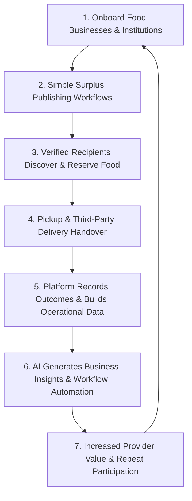

# ManOSalwaKnot — Full Business Model
**Updated Professional Version · PRD v1.1 Aligned**

> **Core Business Model:** ManOSalwaKnot is a B2B-first, hybrid food-surplus redistribution platform that helps food businesses and institutions reduce surplus-food waste through trusted redistribution, assisted by premium AI/software capabilities, optional audience reach, and third-party delivery coordination.  
> **Status:** Business Model Hypothesis / Pre-MVP Validation  
> **Source:** Prepared from the ManOSalwaKnot PRD v1.1 and the proposed AI-premium + third-party delivery revenue models.

---

## 1. Executive Summary

ManOSalwaKnot is positioned as a **food-waste reduction and coordination platform** rather than simply a food-sharing application. Its core value is to connect surplus-food providers with verified recipients while embedding trust, food-safety workflows, traceability, reservation, pickup coordination, and operational visibility.

The recommended business model is **B2B-first and hybrid**. The platform preserves free redistribution for mission-aligned use cases while building commercial revenue around business customers that receive measurable operational value:
1. **Premium B2B AI/software packages** for food businesses and institutions.
2. **Optional paid audience reach / targeted promotion** for participating food businesses, without selling raw personal data.
3. **Third-party delivery coordination** with a commission or service fee per completed delivery.
4. **Optional transaction/service fees** for discounted surplus-food listings.
5. **Institutional reporting, waste analytics, and operational tools** as future B2B services.
6. **Sponsorships and impact partnerships** as a later-stage revenue stream.

> [!IMPORTANT]
> These revenue streams are business-model hypotheses, not yet validated facts. The PRD explicitly requires validation of willingness to pay, pricing, recurring volume, payment workflow, margins, contracts, and compliance value before commercial scale.

---

## 2. Official Business Model Canvas (BMC)

| Block | Description & Strategic Focus |
| :--- | :--- |
| **Key Partners** | Food businesses (restaurants, cafés, bakeries, hotels, caterers); universities and institutions; charities/community organizations; verified recipient organizations; third-party delivery partners; food-safety/compliance stakeholders; technology/cloud providers (Groq, Gemini, Tavily, Supabase, Resend, Vercel, Render); future sponsors and impact partners. |
| **Key Activities** | Surplus-food listing and discovery; provider/recipient verification; safety checklist and moderation workflows; reservation and pickup coordination; delivery coordination; AI assistance; matching; notifications; incident handling; analytics/reporting; partner onboarding; customer support. |
| **Key Resources** | ManOSalwaKnot platform; trusted provider/recipient network; food and reservation data; AI/RAG capabilities; backend infrastructure; product and engineering team; verification and moderation processes; brand trust; partner relationships; analytics and reporting capabilities. |
| **Value Propositions** | **For food businesses:** reduce waste, simplify surplus handling, reach relevant audiences, coordinate pickup/delivery, and gain operational insights. **For recipients:** discover available food through a trusted, affordable workflow. **For institutions:** redistribute surplus with traceability and reporting. **For the ecosystem:** reduce avoidable food waste while prioritizing safety and trust. |
| **Customer Relationships** | Guided onboarding; self-service listing; AI-assisted workflows; account support; verification; notifications; issue/incident handling; business dashboards; reporting; relationship management for institutional customers. |
| **Channels** | ManOSalwaKnot mobile web app; admin interfaces; direct B2B sales; institutional partnerships; university/community partnerships; pilot programs; referrals; targeted business outreach; future partner integrations. |
| **Customer Segments** | **Primary:** restaurants, cafés, bakeries, hotels, caterers, universities/institutions, charities/community organizations, and verified recipient groups. **Secondary/future:** individual users and rescuers. |
| **Cost Structure** | Software development; cloud/database/AI infrastructure; embeddings/RAG infrastructure; support and moderation; verification and compliance operations; customer acquisition; delivery partner operations/integration; payment processing; notification services; legal/compliance and insurance-related costs. |
| **Revenue Streams** | Premium B2B AI/software subscriptions; optional paid audience reach/promotions; delivery coordination commission/service fee; optional transaction/service fee on discounted surplus; institutional contracts and reporting; future sponsorship/impact partnerships. |

---

## 3. Detailed Value Proposition

### 3.1 For Food Businesses
- Reduce avoidable surplus-food waste and the operational effort required to manage it.
- Create listings through a guided workflow with safety and pickup information.
- Reach a relevant audience of verified recipients and/or customers interested in discounted surplus.
- Use AI to assist with listing creation, descriptions, FAQs, workflow guidance, and operational summaries.
- Use optional audience-targeting/promotion features to improve visibility without exposing or selling raw user data.
- Coordinate pickup or third-party delivery through the platform.
- Receive reporting on listings, reservations, successful redistribution, and waste-avoidance indicators.

### 3.2 For Recipients
- Discover relevant surplus food through a structured and trusted marketplace.
- Reserve food with clear status and pickup information.
- Receive transparent handling and safety guidance without the platform claiming that food is automatically safe.
- Use pickup or supported delivery workflows where available.

### 3.3 For Institutions and Organizations
- Redistribute surplus through a controlled process.
- Improve traceability and coordination.
- Receive aggregated operational and impact reporting.
- Potentially integrate ManOSalwaKnot into sustainability, CSR, campus, hospitality, or waste-reduction programs.

---

## 4. Revenue Model

The recommended revenue strategy is diversified but introduced in stages. The free redistribution layer protects the mission, while premium B2B services monetize measurable business value.

| Revenue Stream | Role | How It Works |
| :--- | :--- | :--- |
| **1. Premium AI & Business Platform** | Primary future revenue stream | Monthly/annual B2B subscription for advanced AI-assisted listing, audience insights, analytics, workflow automation, reporting, and business tools. |
| **2. Audience Reach / Promotion** | Add-on revenue | Food businesses can pay for optional promotion or targeted reach to relevant audience segments. ManOSalwaKnot does not sell raw personal data. |
| **3. Third-Party Delivery** | Transaction revenue | ManOSalwaKnot connects providers/recipients with external delivery partners and earns a commission or service fee on completed deliveries. |
| **4. Discounted Surplus Transactions** | Transaction revenue | For paid surplus listings, ManOSalwaKnot may charge a modest service/transaction fee after validating customer willingness to pay. |
| **5. Institutional Contracts** | B2B contract revenue | Universities, hotels, large organizations, NGOs, or other institutions can pay for reporting, coordination, dashboards, or managed redistribution programs. |
| **6. Sponsorship / Impact Partnerships** | Later-stage revenue | Brands, CSR programs, foundations, or impact partners may sponsor redistribution programs, campaigns, or verified community initiatives. |

---

## 5. Premium AI Business Package

The AI premium layer is positioned as a **business productivity and growth product**, not as an autonomous food-safety authority.

| Feature | Business Value |
| :--- | :--- |
| **AI Listing Assistant** | Converts simple provider input into structured draft listings and highlights missing information. |
| **AI Audience Insights** | Summarizes which audience categories, locations, times, and listing types engage with offers, subject to privacy rules. |
| **AI Business Copilot** | Answers questions about the provider's own authorized listings, reservations, performance, and workflow status. |
| **AI Reporting** | Produces understandable summaries of redistribution activity, listing performance, pickup outcomes, and waste-avoidance indicators. |
| **Smart Matching Assistance** | Helps surface suitable verified recipient organizations using backend-authoritative eligibility and scoring. |
| **Food-Safety RAG Assistant** | Provides evidence-grounded educational guidance from approved sources; does not certify food as safe or replace moderation decisions. |

> **Pricing Principle:** Do not lock the final price before validation. Test willingness to pay with pilot customers and compare value-based, per-location, and tiered subscription structures.

---

## 6. Third-Party Delivery Partner Model

ManOSalwaKnot avoids owning a rider fleet. Instead, it acts as a coordination marketplace between eligible food providers/recipients and independent delivery partners.

1. Provider or recipient selects supported delivery where eligible.
2. ManOSalwaKnot requests/coordinates an external delivery partner.
3. Delivery partner accepts the job and completes handover.
4. ManOSalwaKnot records delivery status and operational events.
5. ManOSalwaKnot earns a commission or service fee per completed delivery.

### Delivery Revenue Options
- Percentage commission from the delivery charge.
- Fixed platform/service fee per completed delivery.
- Business subscription with a reduced delivery service fee.
- Institutional managed-delivery contract.

> **Strategic Boundary:** Delivery is a supporting capability, not the identity of ManOSalwaKnot. The platform remains focused on surplus-food redistribution, trust, coordination, and measurable waste reduction.

---

## 7. Business Model Flywheel

---

## 8. Recommended Pricing Architecture

| Tier | Target | Indicative Offering |
| :--- | :--- | :--- |
| **Free / Community** | Mission-aligned redistribution | Basic listing, discovery, reservation, safety workflow, pickup coordination. |
| **Business Starter** | Small food businesses | Higher listing limits, basic analytics, AI listing assistance, business support. |
| **Business Pro** | Active commercial kitchens | Advanced AI assistant, reporting, audience insights, promotion options, priority support. |
| **Institutional** | Universities, hotels, NGOs | Managed workflows, custom dashboards, compliance reporting, integrations. |
| **Delivery** | Per completed delivery | Commission/service fee through third-party delivery coordination. |

---

## 9. Unit Economics Framework

| Metric | Definition |
| :--- | :--- |
| **B2B Customer Acquisition Cost (CAC)** | (Sales + onboarding + marketing cost) / newly paying business customers |
| **Monthly Recurring Revenue (MRR)** | Subscription revenue from active paying businesses |
| **Average Revenue Per Business (ARPU)** | Total recurring + eligible transaction revenue / active paying businesses |
| **Gross Margin** | (Revenue − direct platform/delivery/payment costs) / revenue |
| **Delivery Contribution** | Delivery platform revenue − direct delivery-related platform costs |
| **Customer Lifetime Value (LTV)** | Expected contribution margin per customer over the relationship period |
| **LTV:CAC** | Customer lifetime value / acquisition cost (target > 3:1) |
| **Churn Rate** | Percentage of paying businesses that stop paying within a period |
| **Repeat Provider Rate** | Percentage of providers that publish again after initial use |
| **Listing-to-Reservation Rate** | Total reservations / eligible published listings |
| **Successful Handover Rate** | Completed handovers / confirmed reservations |

---

## 10. Three-Year Financial Scenario Framework

- **Conservative Scenario:** Slow provider adoption; low conversion to paid plans; limited delivery volume; strong emphasis on free community redistribution.
- **Base Scenario:** Moderate B2B conversion; growing repeat usage; initial delivery partnerships; selected institutions adopt reporting and analytics.
- **Upside Scenario:** Strong B2B adoption; high retention; meaningful premium AI usage; larger institutional contracts; delivery network scales across cities.

---

## 11. Go-to-Market Strategy

- **Phase 1 — Controlled Validation:** Recruit 10–15 restaurants, caterers, universities, and community organizations. Run a 12–15 participant controlled pilot.
- **Phase 2 — B2B Pilot:** Offer selected businesses a free trial of the core platform. Test premium AI features with high-volume kitchens. Test delivery coordination in a single zone.
- **Phase 3 — Commercial Launch:** Convert proven use cases into paid B2B packages. Introduce institutional contracts. Scale delivery partnerships by geography.

---

## 12. Risks and Controls

| Risk | Control |
| :--- | :--- |
| **Food Safety Risk** | Never let AI certify food as safe. Maintain safety checklists, human moderation, approved guidance, escalation, and traceability. |
| **AI Hallucination** | Ground safety answers in approved sources; validate retrieved evidence; keep backend facts authoritative. |
| **Low Provider Participation** | Minimize listing effort; provide free entry tier and demonstrate measurable business value. |
| **Delivery Margin Risk** | Use third-party partners; monitor delivery contribution and avoid building an in-house fleet before demand is proven. |
| **Audience Privacy Risk** | Use aggregated insights; never sell raw personal data; enforce strict RLS and authorization. |
| **Low Willingness to Pay** | Validate pricing with pilot customers before committing to expensive premium infrastructure. |

---

## 13. Strategic Positioning & Moats

- **Core Moat:** Trusted network + operational data + provider relationships + verification + repeat workflow.
- **AI Moat:** AI becomes more useful as ManOSalwaKnot accumulates authorized, structured operational data and approved knowledge sources.
- **Network Effect:** More quality providers improve supply; more verified recipients improve demand; better matching improves outcomes for both sides.
- **Commercial Moat:** Premium business tools and institutional reporting become valuable when tied to real operational outcomes.
