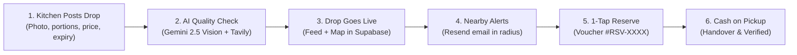

# ManOSalwaKnot — Hackathon Pitch & Technical Methodology
**Social Category · Pak Angels Final Hackathon**  
*In Partnership with iCodeGuru & Aspire Pakistan*

---

## 1. Project Header & Team

> **ManOSalwaKnot**  
> *Rescue extra food. Feed real people.*  
> A food rescue network that connects kitchens with surplus food to the people nearby who can use it, quickly and safely.

### Team Members
- **Eman Aslam Khan** — Team Leader
- **Muhammad Tanveer** — Team Member
- **Tehniat Fatima Khan** — Team Member
- **Sahil Kumar** — Team Member

---

## 2. Executive Outline
1. Introduction & Overview
2. Problem Statement (36M+ Tonnes Metric)
3. Objectives & Core Mission
4. Significance & SDG Alignment
5. How It Works (Step-by-step Flow)
6. Methodology (Architecture & 4 AI Agents)
7. Technology Stack
8. Live Working Prototype & Demo Script
9. Limitations & Next Steps
10. Conclusion & Q/A

---

## 3. Problem Statement & Opportunity

- **36M+ Tonnes** of edible food are wasted every year in Pakistan and South Asia, while millions of families face severe food insecurity.
- **No Fast Channel to Sell or Donate:** Restaurants, wedding banquet halls, and commercial bakeries end shifts with wholesome food nobody will eat, with no quick mechanism to reach nearby people before it spoils.
- **Photos are Difficult to Trust:** Buyers worry about food freshness, packaging cleanliness, and misleading presentation.
- **Checkout Friction:** Online payment gateways and traditional multi-step carts are too slow for hot meals expiring in 2–4 hours.

---

## 4. Objectives & UN Sustainable Development Goals (SDG Alignment)

### Objectives
1. Allow commercial kitchens to post surplus food within 60 seconds.
2. Inspect photos and vendor reputation using AI before food drops go live.
3. Answer user queries in English, Urdu, and Roman Urdu using real platform listings.
4. Match meals intelligently to a user's exact budget (PKR) and party size.
5. Guide kitchens on dynamic markdown pricing based on hours until expiry.
6. Alert nearby subscribers by email when food is posted within their alert radius.
7. Keep pickup simple with voucher code (`#RSV-XXXX`) and cash on pickup.

### SDG Alignment
- **SDG 2: Zero Hunger** — Directly redirects high-calorie, nutritious food to low-income families and students at affordable rates.
- **SDG 11: Sustainable Cities and Communities** — Establishes circular food redistribution infrastructure across metropolitan cities.
- **SDG 12: Responsible Consumption and Production** — Minimizes avoidable organic waste and prevents methane landfill emissions.

---

## 5. How It Works — From Surplus to Pickup

---

## 6. Multi-Agent AI Methodology

### Agent 1: Salwa Assistant (Conversational AI)
- **Model:** Groq Cloud Llama-3.3 70B Versatile.
- **Architecture:** ReAct framework (Thought → Action → Observation → Answer).
- **Custom Tools:**
  1. `search_food_tool`: Searches live Supabase `food_posts` table by food name, location, or price.
  2. `budget_calculator_tool`: Computes price per person and total savings.
  3. `distance_calculator_tool`: Uses Haversine spherical math to determine distance from user.
  4. `research_food_business_tool`: Tavily web lookup for kitchen reputation and hygiene reviews.
- **Bilingual:** Answers in English, Urdu, and Roman Urdu (e.g., *"mjy 200pkr ma khana chahiye"*).

### Agent 2: Food Quality Inspector (Vision & Verification)
- **Model:** Google Gemini 2.5 Flash Vision + Tavily Web Search.
- **Process:**
  - **Step 1 Visual Scan:** Analyzes food photo for packaging seal condition, discoloration, temperature risk, and presentation honesty. Scores from 0 to 100.
  - **Step 2 Web Check:** Looks up vendor name for health department ratings, reviews, and certifications.
  - **Result:** Generates a unified trust badge: `verified`, `good`, `caution`, or `warning`.
- **Mandatory Guardrail:** AI never certifies food as safe; advisory notice is always attached.

### Agent 3: Budget & Portion Matchmaker
- **Model:** Groq LLM + Value Scoring.
- **For Buyers:** Analyzes available meals against budget (PKR), party size, and distance (e.g., Chicken Biryani for 4 people at Rs 350 = Rs 87/person).
- **For Kitchens (Dynamic Markdown Tiers):**
  - **6+ hours to expiry:** 20–30% discount.
  - **3–5 hours to expiry:** 40–50% discount (peak rescue volume).
  - **Under 2 hours to expiry:** 70–80% clearance or route to partner NGO.

### Agent 4: Geo-Alert Agent
- **Model:** Haversine Math + Resend Email API.
- **Process:**
  - When a kitchen publishes a drop, queries `food_subscriptions` table for active subscribers.
  - Calculates Haversine distance between drop coordinates and subscriber location.
  - Dispatches beautifully formatted HTML email alert with meal details, countdown timer, and 1-click pickup CTA.

---

## 7. Technology Stack

| Layer | Technologies Used | Description & Version |
| :--- | :--- | :--- |
| **Frontend** | React 18, TypeScript, Tailwind CSS, Vite | Responsive Single Page Application, live feed, map view, fast UI |
| **Backend API** | FastAPI 0.115, Uvicorn, Python 3.12 | Asynchronous high-performance REST API |
| **AI Framework** | LangChain 0.3.3, LangGraph | ReAct tool orchestration and multi-agent coordination |
| **LLM Inference** | Groq Cloud (Llama-3.3 70B & gpt-oss-120b) | Sub-second natural language inference in English and Urdu |
| **Vision AI** | Google Gemini 2.5 Flash Vision | Multimodal image inspection for packaging and freshness cues |
| **Web Research** | Tavily Search API | Autonomous web research for vendor reputation and hygiene records |
| **Database & Auth** | Supabase (PostgreSQL 15, Auth, RLS) | Relational database, role-based auth, row-level security |
| **Cache & Session** | Upstash Redis | Low-latency chat history cache and session storage |
| **Email Delivery** | Resend API | Transactional email notifications for hyperlocal surplus drops |
| **Cloud Hosting** | Vercel (Frontend) & Render (Backend) | Global edge deployment with continuous integration |

---

## 8. Live Demo Script (Step-by-Step for Judges)

1. **Restaurant / Kitchen Persona:**
   - Navigate to **"Post surplus"**.
   - Upload food photo (or select a preset like Biryani or Rolls).
   - Click **"Inspect Photo AI"** to see Gemini Vision score freshness and packaging.
   - Click **"Publish Rescue Drop"**.
   - Drop appears instantly on the live feed, and alert emails dispatch.
2. **Individual / Rescuer Persona:**
   - Navigate to **"Discover food"** to see the live map and food cards.
   - Test **"AI Matchmaker"** (e.g. Budget: Rs 500, People: 4) to receive ranked meal suggestions.
   - Open **"Ask Salwa"** and ask in English or Roman Urdu (*"kya koi biryani available hai?"*).
   - Click **"Reserve"** on any drop to receive a unique pickup voucher code (`#RSV-XXXX`).
3. **Coordination Hub:**
   - Open **"Business chat"** to see live coordination messages between buyers and the kitchen.

---

## 9. Limitations & Next Steps

### Current Limitations
- Email alerts operate on Resend's development sandbox.
- Payment method in MVP is cash on pickup (eliminates gateway friction).
- Requires internet connection for AI agent calls.

### Roadmap & Next Steps
- Verify custom domain on Resend for production email distribution.
- Integrate optional local digital wallets (JazzCash / EasyPaisa) for online payments.
- Launch controlled pilot with 15 commercial kitchens and partner university hostels in Lahore and Karachi.
