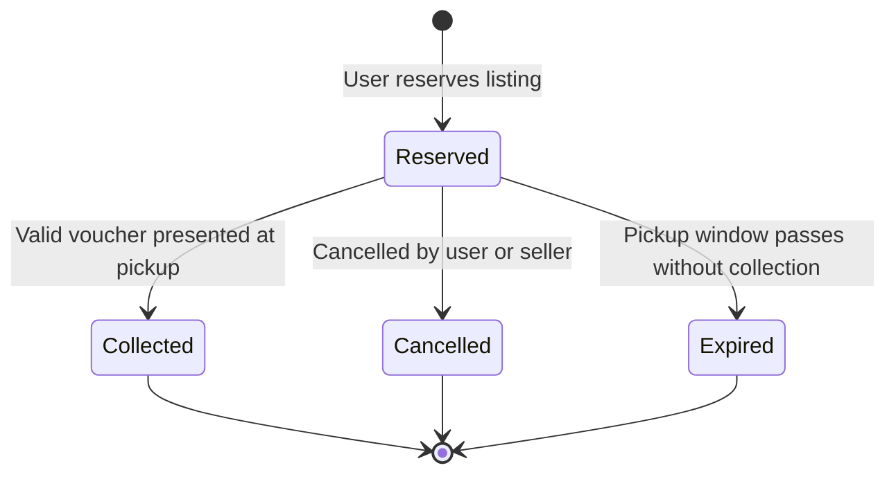
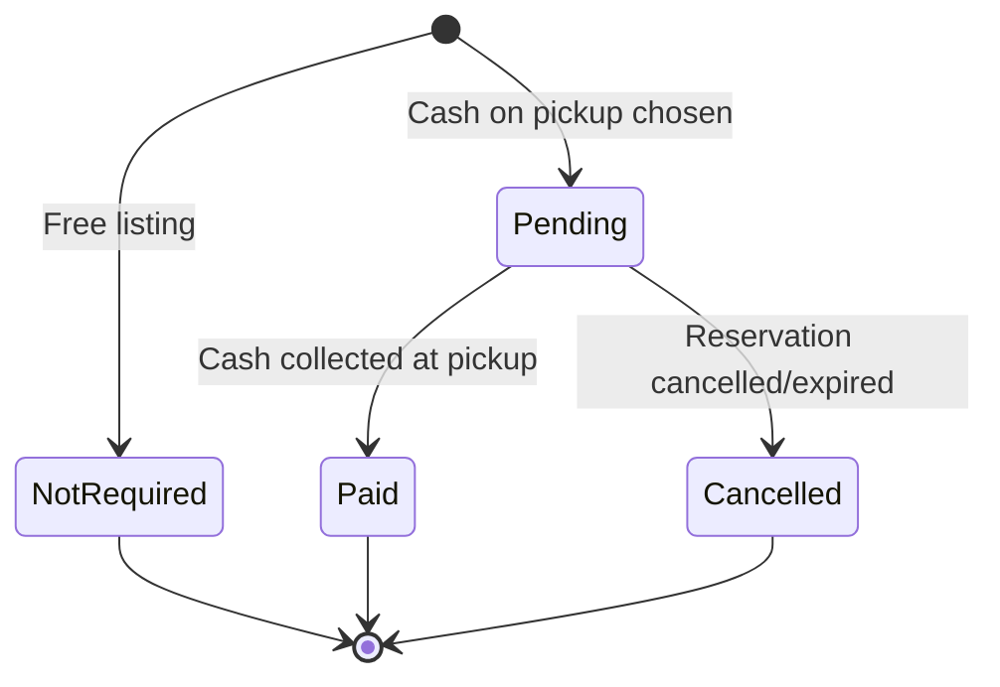
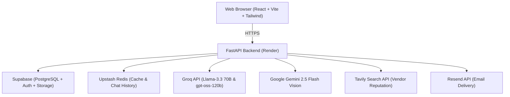

# ManOSalwaKnot — Product Requirements Document (PRD)
**Concise Edition · v0.1 · Draft for Review · 4 October 2026**

> **AI-assisted food rescue and surplus-food redistribution platform for Pakistan**  
> *Pickup-first MVP · Delivery in V2 · All claims are hypotheses to be validated.*  
> **MVP Success Loop:** Surplus → Listing → Moderated → Discover → Reserve → Pay → Pickup → Measured

---

## 1. Document Control

| Field | Detail |
| :--- | :--- |
| **Product** | ManOSalwaKnot |
| **Version** | 0.1 (Concise Edition) |
| **Status** | Draft for review |
| **Date** | 2026-10-04 |
| **Owner** | Product Owner (Eman Aslam Khan & Team) |
| **Source** | Input draft PRD (47 sections), consolidated |
| **Stakeholders** | Product Owner, Engineering, Pilot Providers, Pilot Recipients/NGOs, Admin/Moderators, Investors, Compliance/Food-Safety Reviewer |

**Change Log:** v0.1 (2026-10-04): Restructured input draft into 24 sections, merged duplicates, added acceptance criteria, guardrails, and state machines.

---

## 2. Executive Summary

ManOSalwaKnot is a Pakistan-wide, AI-assisted food rescue and surplus-food redistribution platform. It links food businesses, institutions, NGOs, and individuals through trusted, hyperlocal coordination. Providers publish surplus, set pickup windows, and manage reservations. Recipients discover food by budget, distance, and quantity, reserve it, pay by cash or online where available, and interact with the AI assistant Salwa.

- **Pickup-First MVP:** Delivery is deferred to V2 via third-party partners.
- **AI Assistive Role:** AI assists; rules and humans decide; AI must never certify food as safe from an image alone.
- **Business Model:** B2B-first and hybrid. Every monetization and adoption claim is a hypothesis to be validated.
- **Baseline Stack:** React / TypeScript / Vite / Tailwind · FastAPI · Supabase (PostgreSQL, Auth, RLS) · Redis · LangChain / LangGraph · Groq LLM · Gemini 2.5 Flash Vision · Tavily · Resend · Vercel · Render.

---

## 3. Problem Statement & Opportunity

Food providers hold edible surplus from unpredictable demand, end-of-day stock, wedding banquets, overproduction, cancelled orders, and short shelf life. Existing alternatives fail on seven points:

| ID | Problem | Description |
| :--- | :--- | :--- |
| **P-1** | Discovery | No real-time view of nearby available surplus food. |
| **P-2** | Speed | Short useful window; no fast liquidation channel. |
| **P-3** | Trust | Doubts regarding provider identity, food hygiene, and photo accuracy. |
| **P-4** | Coordination | Lack of structured pickup, reservation, and handover processes. |
| **P-5** | Affordability | Retail food cost remains a barrier for low-budget recipients and students. |
| **P-6** | Visibility | No operational tracking or recovery insight for food providers. |
| **P-7** | Waste Tracking | Environmental and social waste reduction impact is not measurable. |

---

## 4. Vision, Mission & Product Positioning

- **Vision:** Make surplus food easy to rescue, trusted to discover, and simple to redistribute.
- **Mission:** Reduce avoidable food waste in Pakistan through trusted digital infrastructure that moves surplus quickly to people and organizations that can use it.
- **Formula:** $\text{Food Rescue} + \text{Marketplace} + \text{AI Coordination} + \text{Trust Layer}$
- **User Positioning:** *"Find good surplus food near you, reserve it, and pick it up before it goes to waste."*
- **Investor Positioning:** Digital infrastructure for surplus-food redistribution in Pakistan, combining a trusted marketplace, pickup coordination, AI matching, and business intelligence.

### Priority Hierarchy (Top Wins)
1. Food Rescue
2. Trusted Marketplace
3. Pickup & Reservation
4. AI Assistance
5. Business Intelligence
6. Delivery & Advanced Monetization

### Product Principles
- **PR-1 Trust First:** Show provider, food, quantity, price/free, pickup window, handling info, and status.
- **PR-2 Pickup First:** MVP uses controlled pickup only.
- **PR-3 AI Assists, Humans Decide:** AI must not certify food as safe.
- **PR-4 Fast Listing:** Listing creation in minimal steps.
- **PR-5 Hyperlocal:** Prioritize nearby, time-sensitive surplus.
- **PR-6 Privacy by Design:** No unnecessary personal data or private addresses shown publicly.
- **PR-7 Mission Plus Business:** Reduce waste; B2B revenue is a hypothesis.

---

## 5. Goals, Non-Goals & Success Metrics

### Goals
- **G-01:** Prove the full rescue loop in a controlled pilot.
- **G-02:** Fast listing by verified providers.
- **G-03:** Easy discover → reserve → collect workflow.
- **G-04:** Trust layer (verification, moderation, incident logging, audit).
- **G-05:** AI accelerates the loop without adding operational complexity.
- **G-06:** Measurable waste reduction and social impact.
- **G-07:** Gather evidence on business hypotheses.

### Non-Goals (Must NOT Become)
- **NG-01:** Generic food-delivery marketplace.
- **NG-02:** Unsupervised AI food-safety authority.
- **NG-03:** Personal-data marketplace.
- **NG-04:** Dedicated rider-fleet company at MVP.
- **NG-05:** Social media network.
- **NG-06:** Anonymous public food marketplace.
- **NG-07:** Charging users merely for access to donated food.
- **NG-08:** AI-first product with a weak underlying workflow.

---

## 6. Target Users & Personas

| Persona | Goals | Pain Points | Key Needs |
| :--- | :--- | :--- | :--- |
| **Provider** (Restaurants, caterers, bakeries, hotels) | Reduce waste, publish fast, reach nearby recipients, recover costs. | Unpredictable demand, short shelf life, waste disposal fees. | Fast listing, pickup control, reservation visibility, pricing guide. |
| **Individual Recipient** (Students, workers, families) | Find affordable or free meals quickly, trust the seller. | Cannot see nearby surplus, hygiene doubts, checkout friction. | Distance, price, portion count, budget filter, voucher, clear pickup location. |
| **NGO / Institution** (Shelters, hostels, welfare orgs) | Receive surplus at scale, coordinate bulk drops, track impact. | Cannot see surplus in time, cannot measure volume saved. | Radius alerts, coordination chat, redistribution records, impact reports. |
| **Admin / Moderator** | Verify providers, moderate listings, handle incidents, enforce policy. | Unsafe content, fraud, untraceable incidents. | Review queues, audit log, suspend/restore tools, incident workflows. |

---

## 7. Core User Journeys

1. **Provider Journey:** Sign up → submit verification → Admin approves → create listing (name, quantity, price, window, location, photo) → AI photo inspection → publish → receive reservation alert → prepare package → handover on voucher presentation → mark complete.
2. **Recipient Journey:** Sign up → Discover food → filter or AI match (budget, party size, location) → reserve → receive pickup voucher with `#RSV-XXXX` reference → collect within window → pay cash → complete.
3. **NGO / Hostel Journey:** Sign up → set notification radius → receive email alert on new nearby drop → coordinate in business hub → bulk reserve → collect.
4. **Admin Journey:** Sign in → view verification requests → moderate listings → monitor reservations → review audit log.

---

## 8. Scope & Releases

- **MVP (P0):** Registration/login, role selection, provider verification, listing moderation, create/edit listing with photo and expiry, live feed & map discovery, budget matchmaker, reservation voucher (`#RSV-XXXX`), cash on pickup, email alerts via Resend, Salwa chatbot, admin moderation.
- **V1:** Enhanced multi-agent matching, AI listing assistant, advanced analytics dashboard, geo-alert radius optimization.
- **V2:** Third-party delivery integration, premium B2B subscriptions, institutional reporting contracts.
- **Permanently Out of Scope:** Autonomous AI food safety certification, selling raw user data, owning a physical delivery fleet.

---

## 9. Functional Requirements (FR-01 to FR-27)

| ID | Requirement | Priority | Persona | Acceptance Criteria |
| :--- | :--- | :--- | :--- | :--- |
| **FR-01** | User registration and login | P0 | ALL | Valid details submitted → account created and authenticated. |
| **FR-02** | Role selection (Individual, Restaurant, NGO) | P0 | ALL | No role chosen → registration cannot complete. |
| **FR-03** | Phone / account verification before publishing | P0 | ALL | Unverified user attempting publish is prompted to verify. |
| **FR-04** | Admin approval for providers | P0 | PRV, ADM | Unapproved provider listing enters pending review state. |
| **FR-05** | Create surplus listing with photo, price, expiry | P0 | PRV | All required fields present → listing submitted for moderation. |
| **FR-06** | Edit own listing | P0 | PRV | Owner edits change stored and audited; non-owner denied. |
| **FR-07** | Listing moderation | P0 | ADM | Admin approves → published to live feed; rejected → reason logged. |
| **FR-08** | Discovery cards with price, distance, trust badge | P0 | RCP, NGO | Active listing card shows photo, price, time left, distance, rating. |
| **FR-09** | Search and filter by price, distance, category | P0 | RCP, NGO | Filters applied → returns matching active listings only. |
| **FR-10** | 1-Click reservation workflow | P0 | RCP, NGO | User reserves → inventory decremented, reservation created. |
| **FR-11** | Unique `#RSV-XXXX` voucher generation | P0 | RCP, NGO | Confirmed reservation displays unique code for pickup handover. |
| **FR-12** | Cash at pickup payment status | P0 | RCP, NGO | Cash selected → Pending until pickup; payment separate from reservation. |
| **FR-13** | Status synchronization | P0 | ALL | State changes visible to both parties immediately. |
| **FR-14** | Email notifications for new drops | P0 | ALL | Food drop published → subscribers within radius receive Resend alert. |
| **FR-15** | Incident reporting (quality, hygiene, fraud) | P0 | ALL | Incident submitted → routed to Admin moderation queue. |
| **FR-16** | Append-only audit log | P0 | ADM | Admin actions and status transitions written to audit table. |
| **FR-17** | Salwa bilingual chatbot | P0 | ALL | Answers in English and Urdu using real Supabase listings only. |
| **FR-18** | AI Budget & Nutrition Matchmaker | P0 | RCP | Calculates optimal calorie & protein meal for given PKR budget. |
| **FR-19** | AI Food Quality Inspector | P0 | ALL | Gemini Vision inspects photo for packaging, freshness, and cleanliness. |
| **FR-20** | Kitchen dynamic pricing guide | P1 | PRV | Suggests discounts based on hours remaining until expiry. |
| **FR-21** | Geo-targeted email alerts | P0 | ALL | Haversine distance matches subscriber alert radius. |
| **FR-25** | Admin oversight dashboard | P0 | ADM | Admin monitors listings, users, reservations, and metrics. |
| **FR-26** | Automated reservation expiry | P0 | ALL | Uncollected reservations automatically expire at window end. |
| **FR-27** | Handover confirmation on voucher | P0 | PRV, RCP | Provider validates voucher code → marks drop as Collected. |

---

## 10. AI Features & Guardrails

### Rules for All AI (AI-G1 to AI-G6)
- **AI-G1 Authoritative Data Only:** Answer only from live database records; never invent food drops, prices, or restaurants.
- **AI-G2 No Safety Certification:** Never claim food is guaranteed safe from an image alone.
- **AI-G3 Editable Output:** Any AI draft listing must be fully editable by the human provider before publishing.
- **AI-G4 Never Override Safety Rules:** AI suggestions cannot bypass moderation or verification requirements.
- **AI-G5 Full Audit Logging:** All agent prompts, tool calls, and outputs must be logged.
- **AI-G6 Graceful Fallback:** The core marketplace loop must function completely if any external AI API is unreachable.

### Mandatory Food Quality Notice
> *"AI quality insights available. Final food-safety responsibility remains with the provider, platform policies, and applicable public health requirements."*

---

## 11. State Machines

### Reservation States

### Payment States

---

## 12. Trust, Safety & Privacy

- **TS-01 Provider Verification:** Commercial kitchens and restaurants must verify identity before publishing.
- **TS-03 Human Moderation:** Every listing is moderated before public visibility.
- **TS-08 Food Safety Disclaimers:** Every listing card displays clear handling, dietary, and storage advisories.
- **PV-01 Privacy by Design:** Exact street address is only revealed to a recipient after reservation is confirmed. Raw phone numbers are protected.

---

## 13. System Architecture & Tech Stack

---

## 14. Data Model (Core Entities)

1. **profiles:** `id`, `name`, `email`, `role` (`individual`, `restaurant`), `location_text`, `lat`, `lng`, `tier`, `rating`, `rating_count`, `created_at`.
2. **food_posts:** `id`, `user_id`, `food_name`, `quantity`, `unit`, `price`, `original_price`, `expiry_time`, `lat`, `lng`, `location_text`, `photo_url`, `description`, `status` (`available`, `reserved`, `sold`, `expired`), `created_at`.
3. **transactions:** `id`, `buyer_id`, `seller_id`, `food_id`, `amount`, `payment_method` (`cash`), `status`, `created_at`.
4. **food_subscriptions:** `id`, `user_id`, `notify_radius_km`, `email_enabled`, `created_at`.
5. **workspace_messages:** `id`, `food_post_id`, `sender_id`, `sender_name`, `sender_role`, `content`, `timestamp`.
